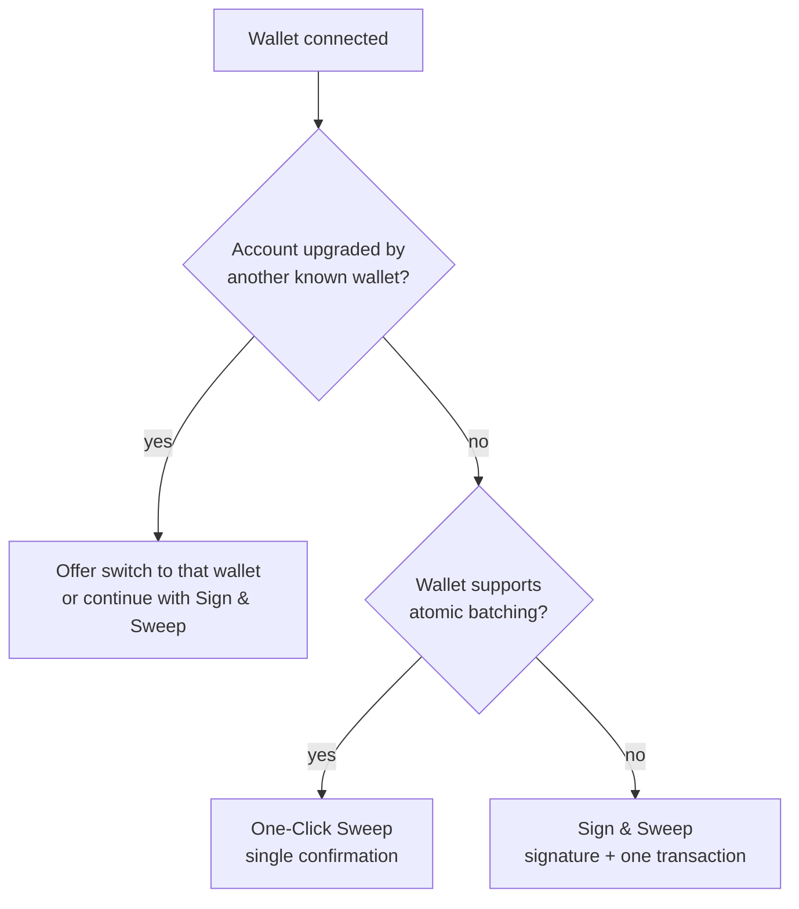

# Connecting Your Wallet

DustSweep works with virtually any wallet that can sign standard typed messages. When you connect, it quietly checks what your wallet can do and picks the smoothest sweep flow available to you.

## How to connect

1. Open [https://app.dustswap.wtf/dustsweep](https://app.dustswap.wtf/dustsweep) and click **Connect**.
2. Choose your wallet from the dialog (browser extension, mobile wallet, or WalletConnect).
3. Approve the connection in your wallet.
4. If your wallet is on another network, approve the switch to **Base**.

## What happens behind the scenes

The moment you connect, DustSweep runs two quick checks in parallel — both read-only, neither costs gas:

1. **Batching capability check.** DustSweep asks your wallet (via the EIP-5792 `wallet_getCapabilities` method) whether it can bundle several actions into one atomic confirmation on Base.
2. **Account delegation check.** DustSweep reads your address's on-chain code on Base to see whether the account has been upgraded to a smart account (EIP-7702) — and if so, by which wallet.

From these two facts, DustSweep picks one of three sweep routes:

| Route | What you experience |
|---|---|
| **One-Click Sweep** | Approvals and the sweep bundled into a single wallet confirmation. See [One-Click Sweeps (EIP-5792)](one-click-sweeps.md). |
| **Switch or continue** | Your address was upgraded by a different wallet; DustSweep offers to switch to it, or continue here with Sign & Sweep. See [EIP-7702 Explained](eip-7702-explained.md). |
| **Sign & Sweep** | One gas-free signature plus one transaction (plus a one-time setup for new tokens). See [Sign & Sweep (Permit2)](sign-and-sweep.md). |

You never need to understand or configure any of this — the interface shows a short notice explaining which route you are on and why.

## Which wallets are supported?

Support is **capability-based, not brand-based**: any wallet that can sign EIP-712 typed data and send transactions works — that covers the vast majority of wallets. Wallets that cannot sign typed data at all see a clear notice with the option to switch wallets.

For the wallet-by-wallet experience (Coinbase Wallet, MetaMask, OKX, TokenPocket, and others), see [Supported Wallets Overview](supported-wallets.md).

> **User Safety Note**
> Always verify you are on **app.dustswap.wtf** before connecting. Connecting a wallet is read-only — it cannot move funds — but every signature or transaction you approve afterwards should be checked against [What the Wallet Prompts Mean](wallet-prompts.md).

## FAQ

**Why does DustSweep ask to switch networks?**
Sweeps execute on Base; quotes, balances, and the smart contracts all live there.

**I connected, but it says batching is not available. Is something wrong?**
No. Your wallet either does not support atomic batching or your account is delegated to another wallet. The Sign & Sweep route works for everyone.

**Does connecting give DustSweep access to my funds?**
No. Connecting only shares your address. Funds move only when you approve a specific transaction or signature.

## Related pages

- [Supported Wallets Overview](supported-wallets.md)
- [One-Click Sweeps (EIP-5792)](one-click-sweeps.md)
- [Sign & Sweep (Permit2)](sign-and-sweep.md)
- [EIP-7702 Explained](eip-7702-explained.md)
