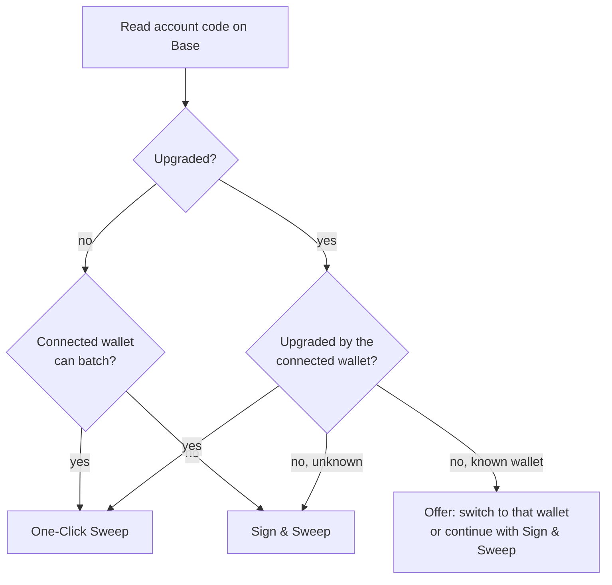

# EIP-7702 Explained

If DustSweep tells you *"this address is already set up for one-click batching with another wallet"*, this page explains what that means, why it happens, and what your options are. Short version: it is normal, your funds are fine, and you can always sweep.

## What EIP-7702 is

EIP-7702 lets a regular wallet address (an EOA) be **upgraded into a smart account** by attaching a small piece of code to it — a pointer to an implementation contract chosen by your wallet. This is what enables features like one-click transaction batching.

Four properties explain everything you will ever see:

1. **It lives on-chain, on your address.** Any app or wallet can read it.
2. **One delegate at a time.** Your address points to exactly one implementation — you cannot be "upgraded by OKX and MetaMask" simultaneously.
3. **Last write wins.** Upgrading from another wallet overwrites the previous delegation.
4. **It is per-network.** Your address can be upgraded on Base but not on Ethereum, or differently on each.

## Why this affects sweeping

Wallets refuse to batch on top of **another wallet's** upgrade — a sensible safety policy. So if you upgraded your account in OKX and later connect the same address in MetaMask, MetaMask will not batch there, and a naive app would just fail confusingly.

DustSweep instead detects the situation up front: it reads your address's code on Base, identifies the delegate against a curated registry of known wallet and infrastructure implementations (MetaMask, OKX, Coinbase/Base, TokenPocket, Trust, Uniswap, Ambire, Bitget, Rainbow, and major infra providers), and routes you accordingly.

## Your options when you see the notice

- **Switch to the wallet that upgraded your account** (e.g. OKX) for the one-click experience. DustSweep names it and offers the switch.
- **Continue where you are** — Sign & Sweep works on any wallet regardless of delegation, with one signature + one transaction. This is never blocked.
- **Advanced:** inside the wallet that owns the upgrade, you can usually revert your account to a plain EOA or re-upgrade it with your preferred wallet. Support for this varies by wallet; treat it as a power-user step.

What **cannot** happen: an app — DustSweep included — can never change or overwrite your delegation. Only your wallet can sign an account upgrade.

> **User Safety Note**
> An upgraded account is normal and safe. But the upgrade prompt itself is powerful: only ever approve an account upgrade that your own wallet initiates through its standard UI. Reject any website that directly asks you to "sign an authorization" to upgrade your account — a malicious delegate would control the account.

## FAQ

**Is something wrong with my account?**
No. It was upgraded by a wallet you used — a standard feature, fully reversible through that wallet.

**Why does DustSweep name a specific wallet (e.g. "OKX Wallet")?**
It matched your delegate code against its registry of known implementations. Unknown delegates simply show as unknown, and you proceed with Sign & Sweep.

**Does delegation give that wallet control over my funds?**
The delegate code defines extra features for your account; you still authorize every action with your key. Stick to delegates installed by reputable wallets.

**Can I be upgraded on Base but not elsewhere?**
Yes — delegation is per-network, which is why DustSweep specifically checks Base.

## Related pages

- [Connecting Your Wallet](connecting-your-wallet.md)
- [One-Click Sweeps (EIP-5792)](one-click-sweeps.md)
- [Supported Wallets Overview](supported-wallets.md)
- [Security Model](security-model.md)
