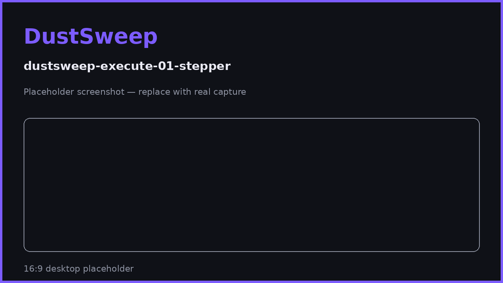
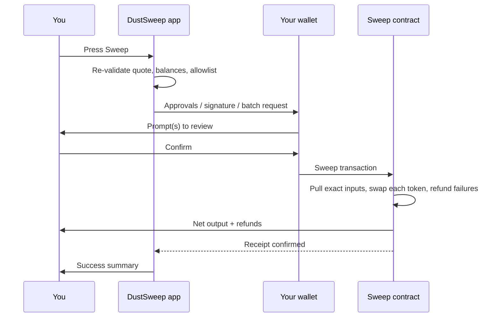

# Executing a Sweep

When you press **Sweep**, DustSweep builds the final transaction, picks the smoothest path your wallet supports, and walks you through each step with an honest progress indicator. This page explains what happens between the button press and the success screen.

## The three execution paths

DustSweep resolved your path when you connected (see [Connecting Your Wallet](connecting-your-wallet.md)). The on-screen stepper always tells you exactly which steps remain:

| Path | Stepper | Wallet interactions |
|---|---|---|
| **One-Click (batching wallets)** | `Confirm batch → Done` | One confirmation bundling approvals + sweep. |
| **Sign & Sweep (most wallets)** | `Setup → Sign → Sweep → Done` (Setup only for first-time tokens) | Exact approvals (first time), one gas-free signature, one transaction. |
| **Standard approvals** | `Approve → Sweep → Done` | Exact approvals, then one transaction. |

Details: [One-Click Sweeps (EIP-5792)](one-click-sweeps.md) · [Sign & Sweep (Permit2)](sign-and-sweep.md).

## What happens at execution

1. **Final safety checks.** The quote deadline is verified (quotes expire after 30 minutes), live balances are re-checked, and routes are validated against the contract's DEX allowlist — on the server *and* on-chain. High price impact (>5%) asks for confirmation.
2. **Wallet prompts.** You approve the path-specific prompts above. Every approval is for the **exact amount** being swept; the signature (if any) lists every token, amount, and the fee.
3. **On-chain execution.** The sweep contract pulls the exact inputs, swaps each token through its chosen DEX, refunds anything that fails, takes the 2% fee from the output, and sends the rest to your wallet — all in one transaction.
4. **Confirmation.** DustSweep waits for the transaction receipt and verifies it succeeded before showing the success screen.

## If something goes wrong

- **You reject a prompt** — the sweep stops cleanly ("Approval cancelled" / "Transaction cancelled"). Nothing was sent.
- **Your wallet's batching fails** — DustSweep automatically falls back to the next reliable path and tells you, e.g. "…approval batch was not ready, sending approvals one by one before the sweep." Nothing is retried behind your back after a rejection.
- **A token fails on-chain** — it is skipped and refunded inside the same transaction; the rest completes.
- **The quote expired** — you are asked to refresh and try again.
- **Double-click protection** — if a sweep request is already waiting in your wallet, pressing Sweep again is ignored.

> **User Safety Note**
> The stepper tells you how many prompts to expect. If your wallet shows prompts that do not match (extra approvals, unfamiliar addresses, unlimited amounts), reject them and compare against [What the Wallet Prompts Mean](wallet-prompts.md).

## FAQ

**How many confirmations will I see?**
One on batching wallets; on other wallets, one signature + one transaction, plus one-time approvals for tokens DustSweep has not swept for you before.

**Can I close the tab while it is pending?**
Once the transaction is submitted to your wallet/network, it completes (or fails) on-chain regardless of the tab. The success screen requires the tab to remain open.

**Why did my wallet estimate fail?**
Some wallets struggle to estimate complex batches; DustSweep supplies explicit gas where needed (e.g. TokenPocket) or falls back to simpler steps automatically.

## Related pages

- [One-Click Sweeps (EIP-5792)](one-click-sweeps.md)
- [Sign & Sweep (Permit2)](sign-and-sweep.md)
- [What the Wallet Prompts Mean](wallet-prompts.md)
- [After the Sweep: Results, Refunds & Rewards](after-the-sweep.md)
