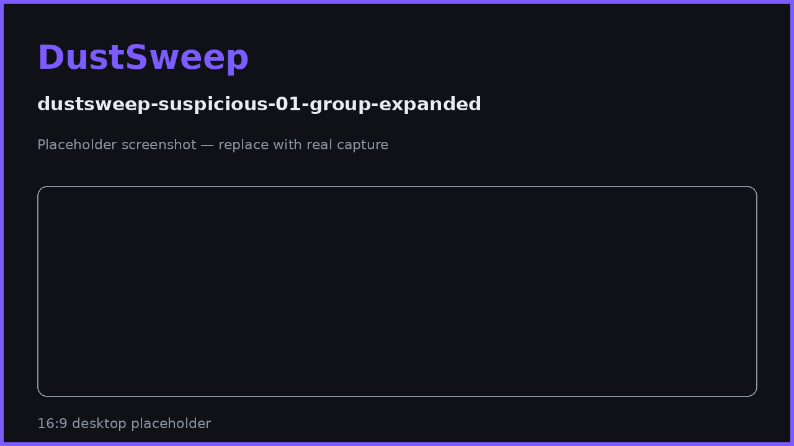

# Hidden & Suspicious Tokens

DustSweep hides certain tokens by default — some because they are too small to matter, others because they look like spam or scams. This page explains how that classification works and how to stay safe around unsolicited tokens.

## Why tokens get hidden

**Hidden (harmless):**

- Value below **$0.01** — real tokens, just not worth a swap.
- No reliable price — DustSweep will not guess a value for you.

**Suspicious (protective):**

Every discovered token passes through risk checks that combine several signals:

- Symbol/name patterns typical of scam tokens (e.g. fake "claim" URLs or impersonation of well-known tickers).
- Missing or unreadable on-chain metadata.
- No price and no liquidity despite a large "balance".
- Whether the token is recognized in DustSweep's verified token data.

Tokens that trip these checks are grouped as **suspicious** and are not selectable for sweeping.

## How token scams usually work

Scam tokens are airdropped to thousands of wallets to make you act:

1. **Bait** — a token appears in your wallet showing a large fake "value", often with a website in its name.
2. **Hook** — visiting that site asks you to "approve" or "claim", requesting a malicious approval or signature.
3. **Drain** — the approval lets the scammer pull your real tokens.

The token itself sitting in your wallet is harmless. The danger only begins when you interact with it or with websites it advertises.

> **User Safety Note**
> Never visit URLs embedded in token names or symbols. Never sign anything to "unlock", "verify", or "claim" an unknown airdrop. DustSweep will never ask you to interact with a suspicious token — they are excluded from sweeping entirely. The safest action for a scam token is no action.

## What DustSweep does and does not do

- ✅ Detects and hides likely spam automatically.
- ✅ Refuses to route suspicious tokens, even if selected by mistake — they are not selectable.
- ✅ Restricts output tokens to ETH/USDC/WETH/USDT, so you can never be tricked into sweeping *into* a fake token.
- ❌ It cannot remove a token from your wallet — nobody can prevent transfers *to* your address on a public blockchain.
- ❌ Heuristics are not perfect. A legitimate but brand-new token may be flagged until it has reliable market data.

## FAQ

**A legitimate token I hold is marked suspicious. What can I do?**
Classification is data-driven; once the token has consistent pricing and liquidity it typically clears. Until then it cannot be swept.

**Can I get rid of scam tokens with DustSweep?**
No — and you should not want to. Swapping a scam token would require interacting with whatever fake liquidity its creator controls. Hide it and ignore it.

**Does holding a scam token put my other funds at risk?**
No. Risk only arises from approvals or signatures you actively grant.

## Related pages

- [Why Some Tokens Can't Be Swept](why-some-tokens-cant-be-swept.md)
- [What You Sign and Why It's Safe](what-you-sign.md)
- [Security Model](security-model.md)
