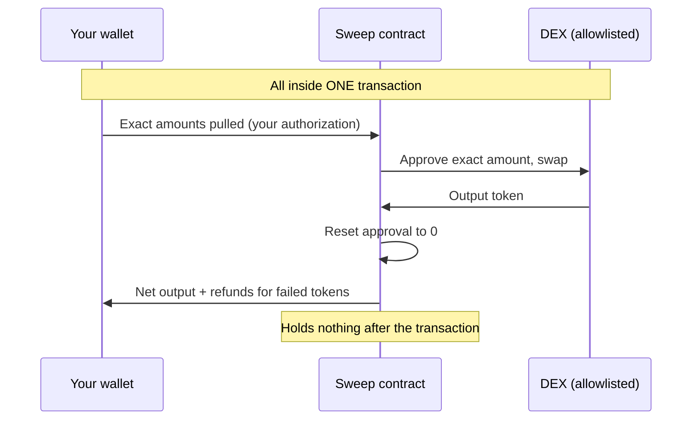
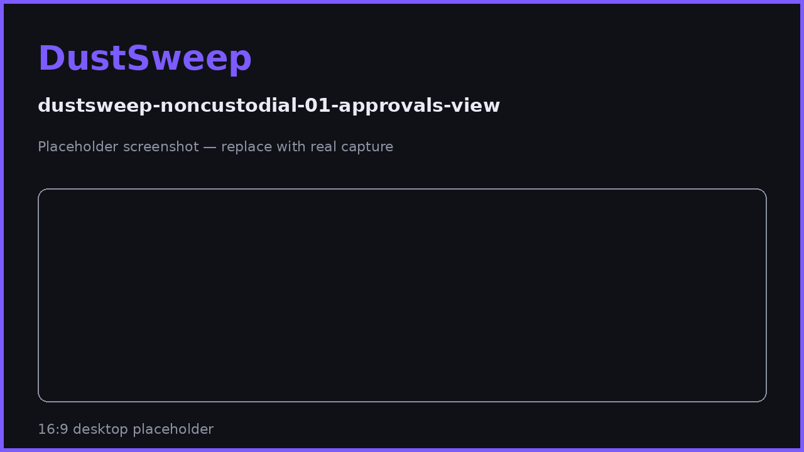

# Non-Custodial Design & Approvals

DustSweep never takes custody of your tokens, and never holds a standing approval that could move them later. This page explains exactly how approvals work in each flow — and how every one of them returns to zero.

## Non-custodial, concretely

"Non-custodial" is often a slogan; here is what it means mechanically in DustSweep:

- Your tokens leave your wallet **only inside the sweep transaction you approve**, and the output (plus any refunds) returns to your wallet **in that same transaction**.
- Between transactions, the sweep contract holds no user funds and has no ability to pull any.
- The contract's accounting is delta-based: it can only operate on what *your* transaction brought in. Other users' sweeps, and anything sitting on the contract, are unreachable to you — and yours to them.

## The approval lifecycle, flow by flow

**One-Click / batch flow:** each selected token gets an `approve(sweep router, exact amount)` bundled with the sweep. The sweep consumes exactly that allowance in the same transaction.

**Sign & Sweep flow:** tokens are approved to **Permit2** (the canonical, ecosystem-shared approval contract) for the exact amounts; the actual pull then requires your fresh, expiring signature per sweep.

**Inside the contract, per swap:** approve the DEX for the exact amount → swap → **reset the approval to zero**. If a swap fails, the failure rolls back that token's approvals entirely. The contract never finishes a transaction with a live approval outstanding — in either direction.

## What DustSweep never asks for

- ❌ Unlimited (`max`) approvals to the DustSweep router.
- ❌ Approvals for tokens you did not select.
- ❌ Permission to act later, outside the sweep you are looking at.
- ❌ Your seed phrase, private key, or any off-app "verification" — never, in any context.

## Checking and revoking approvals yourself

You can independently verify all of this:

1. Open a token-approval viewer (e.g. BaseScan's Token Approvals tool, or revoke.cash) for your address on Base.
2. After a sweep, you will find **no outstanding approval to the DustSweep router** beyond amounts already consumed; in the Sign & Sweep flow you may see allowances to **Permit2** — the shared mechanism also used by Uniswap and other major apps.
3. You may revoke anything at any time; DustSweep will simply re-request the exact amounts next sweep.

> **User Safety Note**
> These guarantees apply to the real DustSweep at **app.dustswap.wtf**. A phishing clone can imitate the interface but cannot imitate the contract's rules — which is why checking the prompt contents (exact amounts, known spender) protects you even on a perfect-looking fake. When in doubt: reject, verify the URL, retry.

## FAQ

**Is approving Permit2 safe?**
Permit2 is Uniswap's canonical approval contract used across DeFi. An allowance to Permit2 alone moves nothing — every transfer through it additionally requires your fresh signature naming a specific app, amounts, and deadline.

**Why did my first sweep need more prompts than my second?**
First-time tokens need their exact approvals set. Later sweeps reuse what is already in place where possible.

**Can the team upgrade the contract to change these rules?**
The sweep contract is not upgradeable; rule changes require deploying a new contract and pointing the app at it. The owner's powers are limited to the allowlist, fee (≤3% cap), pause, and rescuing stuck funds.

## Related pages

- [Security Model](security-model.md)
- [Sign & Sweep (Permit2)](sign-and-sweep.md)
- [What the Wallet Prompts Mean](wallet-prompts.md)
