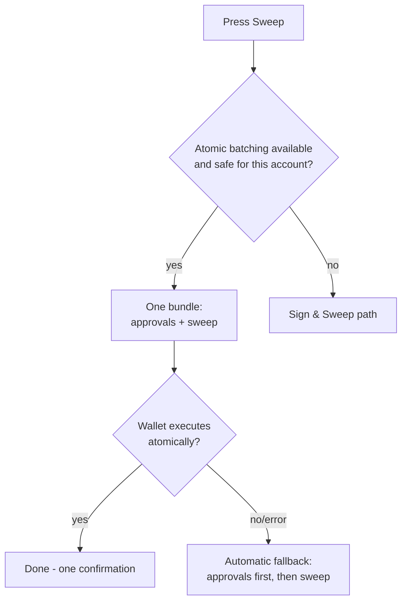

# One-Click Sweeps (EIP-5792)

On wallets that support atomic batching, DustSweep bundles every approval and the sweep itself into a single wallet confirmation. This page explains how that works and what to expect, wallet by wallet.

## What EIP-5792 is

EIP-5792 is a wallet standard that lets an app submit a **bundle of actions** (`wallet_sendCalls`) instead of one transaction at a time, and ask whether the wallet can execute the bundle **atomically** — all together, in one transaction, or not at all (`wallet_getCapabilities`).

For DustSweep this means: *approve token A (exact amount) + approve token B + … + sweep* becomes **one prompt, one transaction**.

## How DustSweep uses it

1. **Capability check on connect.** DustSweep asks your wallet whether atomic batching is available on Base. Possible answers: `supported` (ready now), `ready` (available after a one-time wallet-managed account upgrade), or `unsupported`.
2. **Delegation safety check.** Batching is only attempted when your account is either not upgraded, or upgraded by the *same* wallet you are using — some wallets claim batching support on accounts upgraded elsewhere and then fail. See [EIP-7702 Explained](eip-7702-explained.md).
3. **Bundle submission.** The approvals (exact amounts, to the sweep contract) and the sweep call are sent as one atomic-required bundle. DustSweep then tracks the bundle status until a transaction hash confirms.

## Wallet-specific behavior

| Wallet | Behavior |
|---|---|
| **Coinbase Wallet / Base Account** | Full one-click. Up to 10 tokens: approvals + sweep in **one** prompt. Larger sweeps: exactly **two** prompts (approvals batch, then sweep) for reliable estimation. Gas sponsorship via paymaster when available. |
| **OKX Wallet** | One-click via OKX's own provider; if the account is freshly upgraded by OKX, batching is immediate. |
| **MetaMask** | Supports batching via its Smart Account upgrade, but DustSweep currently keeps MetaMask approval batching **disabled by default** for safety — MetaMask users get the Sign & Sweep path. Batch size is capped at 10 when enabled. |
| **TokenPocket** | Special handling: approvals are batched first with explicit gas, then the sweep is sent after allowances confirm — this avoids TokenPocket gas-estimation failures. |
| **Other wallets** | Anything reporting atomic capability gets the standard bundle; everything else uses [Sign & Sweep](sign-and-sweep.md). |

Wallet capabilities change frequently — per-wallet behavior to be re-verified before publication. See [Supported Wallets Overview](supported-wallets.md).

## The one-time "account upgrade" prompt

If your wallet reports `ready`, the first batch triggers the wallet's own prompt to upgrade your account to a smart account (EIP-7702). This prompt comes **from your wallet, not from DustSweep**, is optional, and unlocks one-click batching going forward. Declining it simply routes you to Sign & Sweep.

## Fallbacks — you are never stuck

If a bundle fails for a technical reason (not your rejection), DustSweep steps down automatically and tells you each time:

1. Bundle approvals only, then send the sweep separately.
2. Send approvals one by one, then the sweep.

A rejection by you is always final — DustSweep never re-prompts a rejected request through another path.

> **User Safety Note**
> A batch prompt shows several actions at once. Verify: each approval is for an **exact token amount** to the DustSweep router, and the final action targets the same router. Your wallet's own upgrade prompt (if any) is wallet-branded — reject any "upgrade" prompt that appears outside your wallet's standard UI.

## FAQ

**My wallet supports batching — why did DustSweep use Sign & Sweep anyway?**
Most commonly your account is upgraded (delegated) to a different wallet, batching is disabled for your wallet brand as a precaution, or the capability check failed. The notice in the app states the reason.

**Is a batched sweep safer or riskier than separate transactions?**
The on-chain result is identical; the contract enforces the same exact-amount approvals either way. Batching just reduces prompts.

**What does "atomic" guarantee?**
All bundled actions land in one transaction — approvals can never be left dangling without the sweep executing.

## Related pages

- [Connecting Your Wallet](connecting-your-wallet.md)
- [EIP-7702 Explained](eip-7702-explained.md)
- [Sign & Sweep (Permit2)](sign-and-sweep.md)
- [Supported Wallets Overview](supported-wallets.md)
