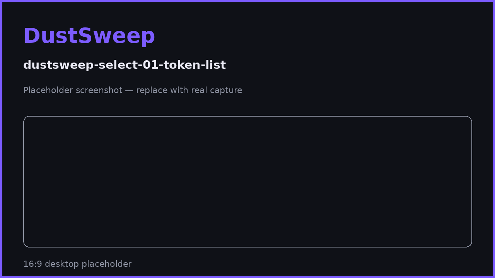
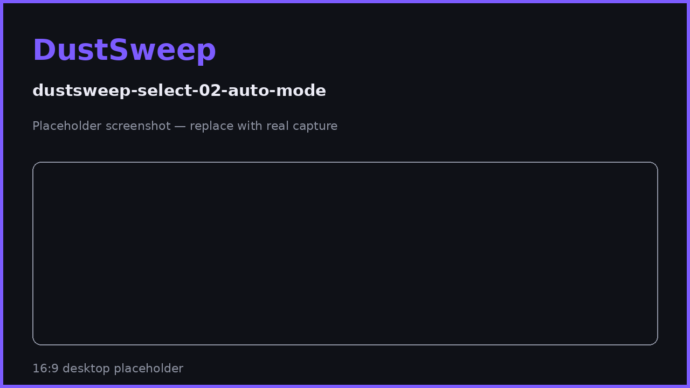

# Scanning & Selecting Tokens

When you connect, DustSweep scans your whole wallet on Base — every token you hold, not just a curated list — then sorts the results so you can choose what to sweep with confidence.

## How the scan works

1. **Full balance discovery.** DustSweep fetches every non-zero ERC-20 balance at your address using a blockchain indexer. No token list limits what it can find.
2. **Pricing.** Each token is priced using live market data (DexScreener, with CoinGecko as a fallback), including liquidity depth and the best DEX for that token.
3. **Classification.** Every token is risk-checked and sorted into a bucket (see below).
4. **Result.** Sweepable tokens appear in the selection list, sorted by USD value. The rest are grouped with their reasons.

The scan usually takes a few seconds; results are briefly cached, so repeated scans are fast. If a scan takes longer than 45 seconds it times out and you can refresh.

## The buckets

| Bucket | Meaning |
|---|---|
| **Swappable** | Priced, liquid, passed safety checks, worth at least $0.01 — ready to select. |
| **Hidden** | Below the $0.01 minimum, or no reliable price could be found. |
| **Suspicious** | Flagged by spam/scam heuristics — hidden by default for your protection. |
| **Unavailable** | Other exclusions, e.g. the token is one of the output assets. |

See [Why Some Tokens Can't Be Swept](why-some-tokens-cant-be-swept.md) and [Hidden & Suspicious Tokens](hidden-and-suspicious-tokens.md) for details.

## Selecting tokens

You have three ways to build your selection:

- **Manual** — tap each token you want to include.
- **Select all** — adds every swappable token (up to the 50-token limit).
- **Auto-mode** — automatically selects every token at or below a USD threshold you set (default $100). Useful for "sweep everything small, keep my real positions".

Rules applied automatically:

- Maximum **50 tokens** per sweep.
- Tokens matching your chosen **output token** are excluded (you cannot swap USDC into USDC).
- Changing your selection, output token, or slippage refreshes the quote.

> **User Safety Note**
> The scan shows what you hold; it never moves anything. Be deliberate with tokens in the **suspicious** group — they are hidden because they match known spam/scam patterns. You do not need to interact with a scam token to "get rid of it"; simply leaving it untouched is safe.

## FAQ

**The scan missed a token I know I hold.**
Refresh balances. If it still does not appear, it may have no price data yet — check the hidden group.

**Why is a token's USD value slightly different from another site?**
Prices come from aggregated DEX market data and refresh continuously; small differences between sources are normal.

**Can I sweep my entire balance of a large token?**
Yes — selection is not limited to "dust". Anything swappable can be included, at its full balance.

## Related pages

- [Why Some Tokens Can't Be Swept](why-some-tokens-cant-be-swept.md)
- [Hidden & Suspicious Tokens](hidden-and-suspicious-tokens.md)
- [Choosing an Output Token](choosing-an-output-token.md)
- [Understanding Your Quote](understanding-your-quote.md)
