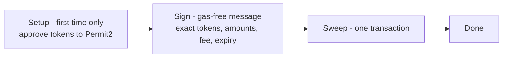
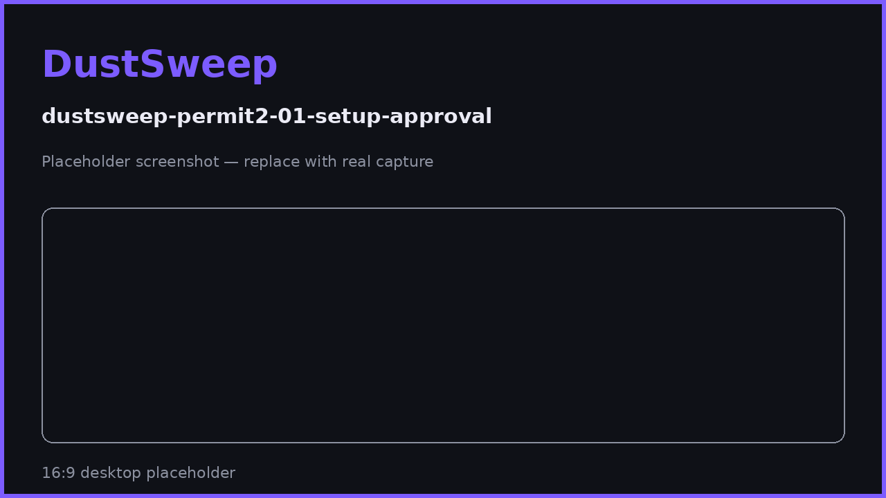

# Sign & Sweep (Permit2)

The universal path: one gas-free signature plus one transaction, on virtually any wallet. This is DustSweep's robust fallback — and for most wallets, its everyday flow.

## What Permit2 is

Permit2 (`0x000000000022D473030F116dDEE9F6B43aC78BA3`) is Uniswap's canonical approval contract, used across the DeFi ecosystem. Instead of sending an on-chain approval transaction per token per app, you grant tokens to Permit2 once — then individual apps receive **signed, single-use, expiring permissions** for exact amounts.

## The flow

1. **Setup (only when needed).** Any selected token that Permit2 cannot yet pull gets a standard `approve` transaction for the **exact amount** being swept. Tokens covered by an existing allowance skip this entirely — repeat sweeps usually start at step 2. The app shows "one-time setup for N tokens" so you know what to expect.
2. **Sign.** Your wallet shows a structured, readable message (EIP-712, titled `PermitBatchWitnessTransferFrom`) listing every token and exact amount, the sweep contract as the only spender, a single-use nonce, a **30-minute expiry**, and a "witness" that locks in the routes, output token, recipient, minimum output, and the exact fee. Signing costs no gas.
3. **Sweep.** One transaction submits everything. On-chain, Permit2 verifies your signature and transfers the exact amounts to the sweep contract, which executes the swaps, refunds any failures, takes the fee you signed, and delivers the output.

## Why this design is safe

- **Exact amounts only.** Both the setup approvals and the signed permission cover exactly what you selected — no unlimited allowance to DustSweep ever exists.
- **Single-use and expiring.** The signature has a one-time nonce and dies after 30 minutes.
- **Bound to you.** The sweep contract only accepts the signature from the address that signed it — a stolen copy is useless to anyone else.
- **Tamper-proof intent.** Routes, output token, recipient, minimum output, and the fee are hashed into the signature. Changing *any* of them afterwards invalidates it.
- **Delegation-independent.** This path works regardless of EIP-7702 account upgrades — which is why every wallet always has a working route.

More depth: [What You Sign and Why It's Safe](what-you-sign.md).

> **User Safety Note**
> A legitimate DustSweep signature request is always from the **Permit2** contract, lists only the tokens you selected with exact amounts, and expires in 30 minutes. Treat any typed-data request that does not match this pattern — on any site — as hostile, and reject it.

## FAQ

**Why does my first sweep need approvals but later ones don't?**
The setup approvals grant Permit2 the ability to pull those tokens. Once an allowance covers a token's amount, future sweeps need only the signature.

**Is the signature an on-chain transaction?**
No — it is free and instant. Only the final sweep transaction pays gas.

**What if I sign but never send the transaction?**
Nothing happens. The signature expires after 30 minutes and its nonce can never authorize anything else.

**Does this give Uniswap or other Permit2 apps access to my tokens?**
The allowance to Permit2 is the same shared, widely-audited mechanism other major apps use — but every actual transfer through it requires a fresh signature from you for a specific app, amount, and deadline.

## Related pages

- [What You Sign and Why It's Safe](what-you-sign.md)
- [Non-Custodial Design & Approvals](non-custodial-design.md)
- [Executing a Sweep](executing-a-sweep.md)
- [One-Click Sweeps (EIP-5792)](one-click-sweeps.md)
