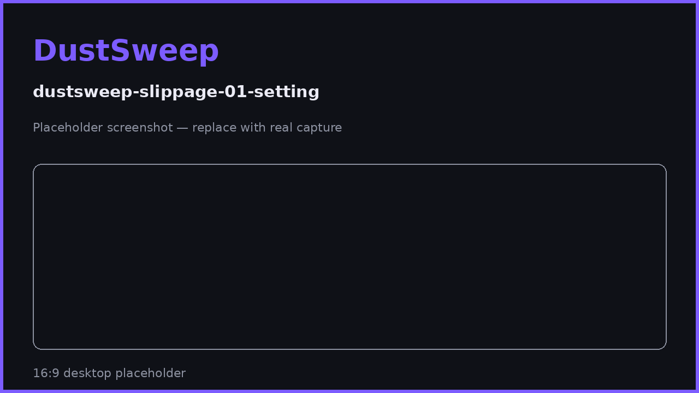

# Slippage & Price Impact

Prices move between the moment you get a quote and the moment your sweep executes. Slippage settings define how much movement you accept; price impact measures how much your own trade moves the market. DustSweep protects you on both, per token.

## Slippage

**What it is.** The difference between the quoted output and the actual output at execution time.

**Your setting.** Default tolerance is **0.5%**, adjustable up to a maximum of 30%. For typical dust sweeps the default is right for almost everyone.

**How DustSweep enforces it — two layers:**

1. **Per token:** every token's swap instruction carries its own minimum output (`quote × (1 − tolerance)`). A swap that cannot meet its floor fails — and on the current contract, a failed swap is simply **skipped and refunded**, never executed at a bad price.
2. **Whole sweep:** the contract additionally enforces an overall minimum at settlement as a backstop.

So the worst case for any single token is: it does not get swapped and comes back to you. It is never sold below its floor.

## Price impact

**What it is.** How much your own trade moves the pool's price — significant mainly for tokens with thin liquidity.

**DustSweep's guard:** if any route's price impact exceeds **5%**, the app stops and asks you to explicitly confirm before sweeping.

When you see this warning, consider:

- Sweeping a smaller amount of that token.
- Removing that token from the selection.
- Accepting the impact knowingly — for true dust, a few percent on a $1 balance may be fine.

## Choosing a slippage setting

| Setting | Effect |
|---|---|
| Lower (e.g. 0.1–0.5%) | Tighter price protection; more tokens may be skipped (and refunded) in fast markets. |
| Higher (e.g. 1–3%) | More tokens succeed first try; each accepts a slightly worse worst-case price. |

> **User Safety Note**
> Never set high slippage to "force" an illiquid token through. A high tolerance is exactly what sandwich bots exploit — you are signing permission to receive that much less. If a token only swaps at 10%+ slippage, the honest answer is that its market is too thin; let DustSweep skip and refund it.

## FAQ

**Does higher slippage mean I always get less?**
No — slippage is a worst-case floor, not the expected outcome. You receive whatever the market gives at execution, floored by your setting.

**A token was skipped for slippage. Did I lose anything?**
No. Its full amount was refunded to your wallet in the same transaction. You can retry with a fresh quote.

**Is the protocol fee related to slippage?**
No. The 2% fee applies to the realized output; slippage settings only set the minimum acceptable output. See [Fees](fees.md).

## Related pages

- [Understanding Your Quote](understanding-your-quote.md)
- [Why Some Tokens Can't Be Swept](why-some-tokens-cant-be-swept.md)
- [After the Sweep: Results, Refunds & Rewards](after-the-sweep.md)
