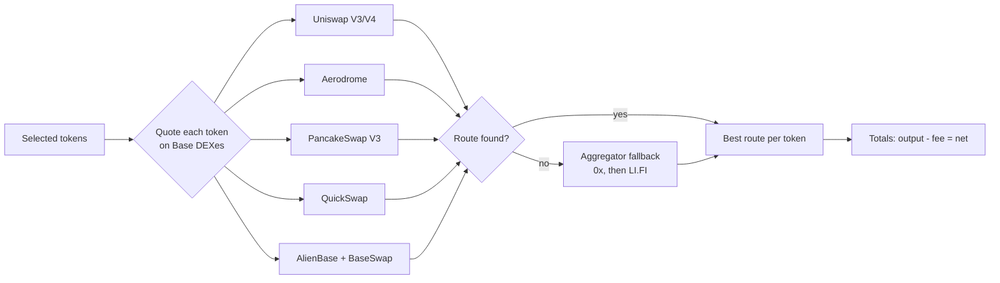
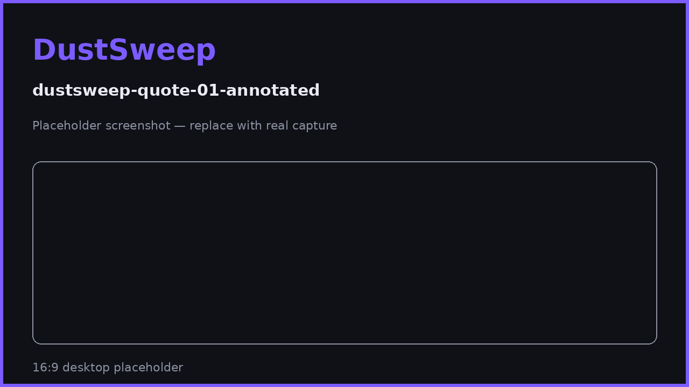

# Understanding Your Quote

Before you sweep, DustSweep shows exactly what you should expect: the route for every token, the total estimated output, the fee, and the gas estimate. This page explains each number.

## How the quote is built

When you confirm your selection, DustSweep:

1. **Re-checks your live balances** — if a balance changed since the scan, that token is flagged instead of mis-quoted.
2. **Quotes every token on Base's DEXes** — Uniswap V3, Uniswap V4, Aerodrome (classic + Slipstream), PancakeSwap V3, QuickSwap (Algebra), AlienBase, and BaseSwap. If none of them can trade a token, DustSweep falls back to an aggregator (0x first, then LI.FI) for that token only — so even awkward long-tail tokens still get a route.
3. **Picks the best route per token** — the venue returning the highest output wins; the chosen DEX is shown next to each token.
4. **Applies your slippage tolerance** to set a minimum acceptable output per token (default 0.5%).
5. **Calculates totals** — gross estimated output, the 2% protocol fee, net output, USD values, and an estimated gas cost.

## Reading the quote panel

| Field | Meaning |
|---|---|
| **Route per token** | Which DEX this token will trade through, and its estimated output. |
| **Total estimated output** | Sum of all per-token estimates, before fees. |
| **Protocol fee** | 2% of the output (on-chain cap: 3%). See [Fees](fees.md). |
| **Net estimated output** | What is expected to reach your wallet. |
| **Gas estimate** | Approximate Base network cost — typically cents. |
| **Skipped tokens** | Tokens that could not be quoted, each with a reason. |

## Quote validity

- A quote is valid for **30 minutes**. After that the sweep contract itself rejects it, and the app asks you to refresh.
- Estimates are estimates: final amounts depend on market movement between quoting and execution. Your protection is the slippage floor — see [Slippage & Price Impact](slippage-and-price-impact.md).
- If any token's route has a price impact above **5%**, DustSweep asks for explicit confirmation before proceeding.

> **User Safety Note**
> The minimum output you are protected by is set from this quote. If you walk away and come back later, refresh the quote rather than executing a stale one — markets move, and a fresh quote keeps your protection tight.

## FAQ

**Why is each token routed separately instead of through one aggregator?**
Dust tokens live in very different pools. Quoting each token across all venues independently consistently finds better routes for long-tail assets.

**Why did the total change when I re-quoted?**
Prices moved, or a different DEX now offers the best route. Both are normal.

**What does "No route available" mean on the Sweep button?**
None of the selected tokens could be quoted right now. Check the skipped-token reasons.

## Related pages

- [Fees](fees.md)
- [Slippage & Price Impact](slippage-and-price-impact.md)
- [Executing a Sweep](executing-a-sweep.md)
