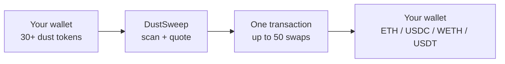

# What is DustSweep?

DustSweep turns the small, leftover token balances ("dust") in your wallet into one useful token — ETH, USDC, WETH, or USDT — in a single sweep, with as few wallet confirmations as possible.

## The problem it solves

If you are active on-chain, your wallet slowly fills up with balances that are too small to do anything with:

- Leftovers from swaps and liquidity positions.
- Airdrops and reward tokens worth a few cents or dollars.
- Tokens a DEX interface will not even list.

Selling each one normally costs an approval transaction plus a swap transaction per token. For a $0.40 balance, that is simply not worth doing — so the dust sits there forever.

## What DustSweep does

DustSweep is a feature of DustSwap, available at [https://app.dustswap.wtf/dustsweep](https://app.dustswap.wtf/dustsweep). In one flow it:

1. **Scans** your wallet for every non-zero token balance on Base — not just tokens from a curated list.
2. **Classifies** what it finds: sellable tokens are shown, spam and suspicious tokens are hidden by default.
3. **Routes** each selected token through the best of several Base DEXes (Uniswap, Aerodrome, PancakeSwap, BaseSwap, and others).
4. **Executes** all swaps in a single on-chain transaction through DustSweep's own sweep contract, sweeping up to **50 tokens at once**.
5. **Delivers** the combined output to your wallet, minus a transparent protocol fee (2%, hard-capped at 3% by the smart contract).

## Non-custodial by design

DustSweep never holds your funds. Tokens move from your wallet, through the sweep contract, through the DEXes, and back to your wallet **inside one atomic transaction**. The contract:

- Only pulls the **exact amounts** you selected — never unlimited approvals.
- Resets every internal approval to zero before the transaction ends.
- Refunds any token whose swap fails, in the same transaction, instead of failing the whole sweep.

> **User Safety Note**
> DustSweep will never ask you for an unlimited token approval to its own contract, and it cannot move tokens you did not select. If a prompt asks for more than you expect, reject it and see [What You Sign and Why It's Safe](what-you-sign.md).

## Who this documentation is for

The user guide pages are written for everyday users — no technical background needed. Pages such as [One-Click Sweeps (EIP-5792)](one-click-sweeps.md), [Sign & Sweep (Permit2)](sign-and-sweep.md), and [Security Model](security-model.md) add depth for advanced users, developers, and reviewers.

## FAQ

**Is DustSweep a token or an exchange?**
Neither. It is a tool inside the DustSwap app that batches swaps you choose through existing public DEXes.

**Which network does it work on?**
Base mainnet only. See [Supported Network & Tokens](supported-network-and-tokens.md).

**Does it cost anything?**
A 2% protocol fee taken from the swap output (the smart contract caps the fee at 3%), plus normal Base network gas — typically a few cents. See [Fees](fees.md).

## Related pages

- [Quick Start: Your First Sweep](quick-start.md)
-