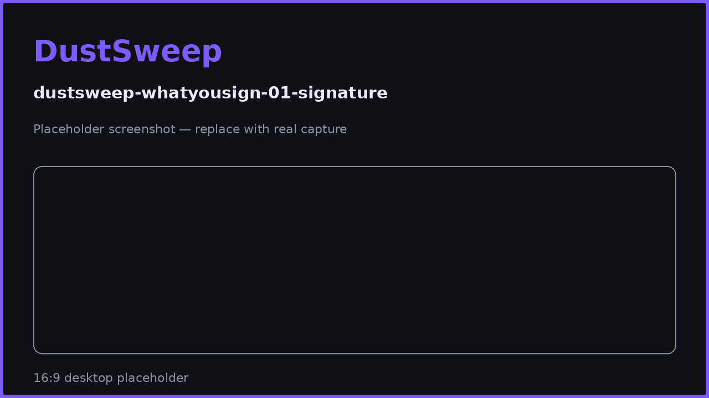

# What You Sign and Why It's Safe

The gas-free signature in the Sign & Sweep flow is the part of DustSweep users ask about most. This page shows exactly what is inside that message, what it can and cannot do, and how to recognize a fake.

## The message, field by field

Your wallet displays a structured EIP-712 message — readable data, not a hex blob. It is a `PermitBatchWitnessTransferFrom` request verified by the canonical **Permit2** contract:

| Field | Content | Why it protects you |
|---|---|---|
| `permitted[]` | Every token and its **exact amount** | Nothing outside this list can move — not one extra wei. |
| `spender` | The DustSweep router address | Only that contract can use the signature. |
| `nonce` | A random one-time number | The signature works **once**, ever. |
| `deadline` | ~30 minutes from your quote | After that, the signature is dead. |
| `witness` | Hash of routes + output token + recipient + minimum output + deadline + **fee** | The entire sweep plan is frozen at signing time. |

The `witness` is the key innovation: when the sweep executes, the contract independently recomputes this hash from the actual routes and parameters it was given. If the backend — or anyone in between — changed a route, the recipient, your minimum output, or the fee after you signed, **the hashes will not match and the transaction fails**.

## What the signature can never do

- ❌ Move tokens not listed, or amounts beyond those listed.
- ❌ Be used after its deadline, or twice.
- ❌ Be used by anyone else: the contract hardcodes the signature owner to the transaction sender, so a leaked signature is unusable by an attacker from their own address.
- ❌ Send output anywhere except the recipient frozen in the witness.
- ❌ Pay a different fee than the one you signed.

## Why signing is gas-free

A signature is a piece of math computed locally by your wallet — it touches the blockchain only when included in the sweep transaction. If you sign and never sweep, nothing happens, and the message expires worthless.

## Recognizing a legitimate request

A real DustSweep signature request always has **all** of these:

- ✅ Verifying contract: **Permit2** (`0x000000000022D473030F116dDEE9F6B43aC78BA3`).
- ✅ Primary type: `PermitBatchWitnessTransferFrom`.
- ✅ Exactly the tokens and amounts you selected.
- ✅ A deadline about 30 minutes ahead.
- ✅ Triggered on **app.dustswap.wtf**, at the "Sign" step of the stepper.

> **User Safety Note**
> Signature phishing — not contract failures — is how most users lose funds in DeFi. Apply the checklist above to **every** typed-data request on every site. Reject `eth_sign`/raw-hex requests outright (DustSweep never uses them), and treat "sign to verify your wallet / claim / unlock" messages anywhere as hostile by default.

## FAQ

**My wallet shows the message as raw JSON. Is that wrong?**
No — wallets render typed data differently. Check the fields: token list, amounts, spender, deadline.

**What if I sign but my transaction fails?**
The nonce may remain unused depending on failure point; either way the signature still expires in 30 minutes and can authorize nothing else. Get a fresh quote and sign again.

**Could DustSweep's backend trick me into signing something different from what the UI shows?**
The wallet displays the actual message being signed — that display is your source of truth, which is why reading it matters. And once signed, nothing in it can be changed.

## Related pages

- [Sign & Sweep (Permit2)](sign-and-sweep.md)
- [What the Wallet Prompts Mean](wallet-prompts.md)
- [Security Model](security-model.md)
