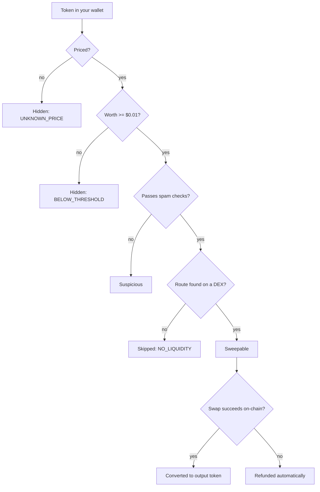

# Why Some Tokens Can't Be Swept

Not every token in your wallet can be converted. This page lists every reason DustSweep may exclude or skip a token, what each one means, and what (if anything) you can do about it.

## Reasons shown during scanning

| Reason | Meaning | What you can do |
|---|---|---|
| `BELOW_THRESHOLD` | The balance is worth less than **$0.01**. | Nothing needed — it is not economical to swap. |
| `UNKNOWN_PRICE` | No reliable USD price found in market data. | Wait — prices appear once the token has active markets. |
| `SPAM_OR_DENYLISTED` | Matched spam/scam heuristics. | Leave it alone. See [Hidden & Suspicious Tokens](hidden-and-suspicious-tokens.md). |
| `OUTPUT_ASSET` | The token is one of the sweep output assets. | Choose a different output token, or swap it via the normal Swap page. |

## Reasons shown during quoting

| Reason | Meaning | What you can do |
|---|---|---|
| `NO_LIQUIDITY` | No DEX on Base offered a route for this token. | Nothing — without liquidity there is no honest way to sell it. |
| `QUOTE_FAILED` | A quoting source errored for this token. | Retry; often temporary. |
| `BALANCE_CHANGED` | Your live balance no longer matches the scanned amount. | Refresh balances and re-quote. |
| `NATIVE_WRAP_REQUIRED` | Native ETH cannot be a sweep input. | Wrap ETH to WETH first if you really want to include it. |

## Reasons during execution

On the current sweep contract, a token that fails **during** the sweep does not block the others: its swap is skipped on-chain and the full input amount is **refunded to your wallet in the same transaction**. You will see it reported on the success screen, and on BaseScan as `RouteSkipped` and `InputRefunded` events.

> **User Safety Note**
> If a token has no liquidity and no price, be wary of any third-party site claiming it can "unlock" or "recover" its value — that is a common scam pattern. A token nobody will buy has no recoverable value.

## FAQ

**A token shows a price on the scan but gets skipped at quoting. Why?**
A price estimate can exist while actual sellable liquidity does not — the quote stage checks real routes with your real amount.

**Will an unsweepable token ever become sweepable?**
Yes, if it gains liquidity and reliable pricing. Re-scan any time.

**Can I force-include a hidden token?**
Tokens without a price or below the threshold cannot be quoted meaningfully, so they cannot be force-included.

## Related pages

- [Scanning & Selecting Tokens](scanning-and-selecting-tokens.md)
- [Hidden & Suspicious Tokens](hidden-and-suspicious-tokens.md)
- [After the Sweep: Results, Refunds & Rewards](after-the-sweep.md)
