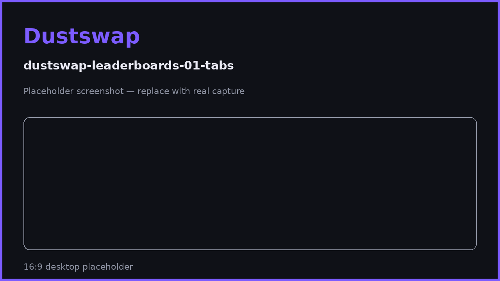

# Leaderboards

Three rankings track how you compare across the DustSwap community: total Particle Points, referral performance, and swap volume. Your standing is expected to matter — leaderboard rewards are planned for the future TGE.

## The three boards

| Board | Ranks by | Updates |
|---|---|---|
| **Particle Points** | Total PP earned, all-time | Continuously |
| **Referrals** | Referral performance (invitees and commission) | Periodic snapshot, refreshed every few hours |
| **Volume** | Swap volume through DustSwap | Continuously, from verified swaps |

Open the **Leaderboard** page and switch between the three tabs. Each board shows ranked users with their display names and avatars (set yours on your Profile), and — when your wallet is connected — **your own row and rank**, even if you're outside the visible page.

## How ranking works

- All rankings are computed server-side from verified activity — the same verified transactions and actions that award PP. Display names and avatars are cosmetic and cannot affect rank.
- Boards are paginated; you can page through the full standings.
- The **referral board** is a cached snapshot refreshed every few hours, so a brand-new referral can take a few hours to appear there (your Profile stats update sooner).

## Climbing the boards

- **PP board:** consistency beats bursts — a maintained streak multiplies everything you earn up to 4×. See [Streak Boost Explained](../rewards/streak-boost-explained.md).
- **Referral board:** share your link where it's genuinely useful; both sides earn 500 PP and your 20% lifetime commission compounds. See [How Referrals Work](../referrals/how-referrals-work.md).
- **Volume board:** swap volume through the app counts after on-chain verification — wash-trading fake volume with unverifiable or duplicate transactions does not work.

## Leaderboard rewards & the TGE

DustSwap plans to reward leaderboard standing at the **TGE (Token Generation Event)**. What this means today:

- Your rank and PP are the record of your contribution — they are being tracked now.
- Reward structure, allocation criteria, and timing have **not been finalized or announced**. Figures, mechanics, and eligibility will be published through official channels before the event.
- Until then, no specific reward for any rank is guaranteed — keep building, but treat unannounced details as exactly that.

> **User Safety Note**
> Ahead of any TGE, expect scammers: fake "claim your allocation" sites, fake snapshots, and DMs offering early access. DustSwap announcements come only through the app and the official Discord — never through DMs, and never requiring you to "verify" your wallet by signing on an unknown site.

## FAQ

**My rank dropped without me doing anything.**
Others earned faster. Rankings are relative; check the PP history on your Profile to confirm your own totals are intact.

**Why does the referral board not show my newest referral?**
It refreshes on a snapshot every few hours. Your Profile referral stats are the live source.

**Do leaderboard positions reset?**
The current boards are all-time standings. Season-based resets, if introduced, will be announced beforehand.

**Is there a minimum to appear on the boards?**
You appear once you have qualifying activity (points, check-ins, or referral/volume records).

## Related pages

- [What are Particle Points?](../rewards/pp-rewards.md)
- [Streak Boost Explained](../rewards/streak-boost-explained.md)
- [How Referrals Work](../referrals/how-referrals-work.md)
