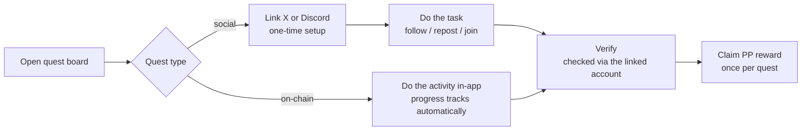
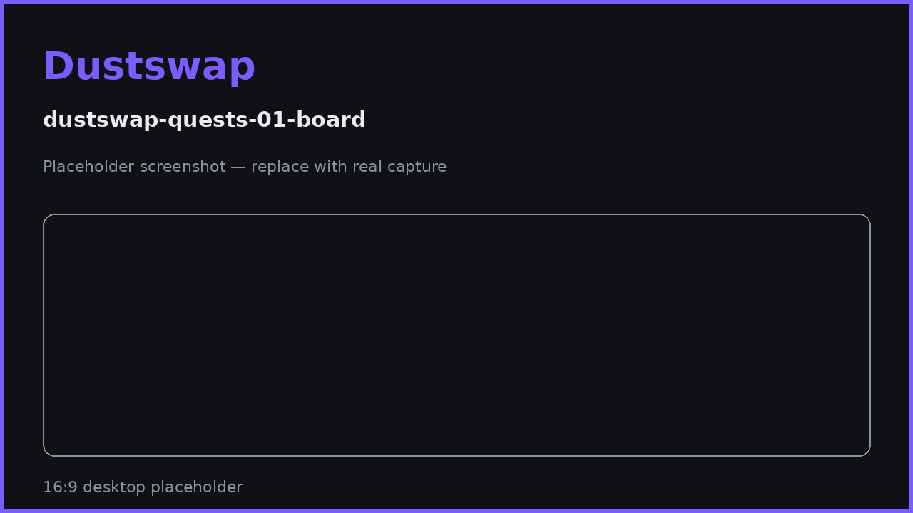

# How Quests Work

Quests are one-time tasks — social and on-chain — that pay fixed PP rewards. The quest board changes over time as new campaigns launch, so this page explains the system; the live board shows what's available right now.

## Quest types

| Category | Platform | Examples | Verified by |
|---|---|---|---|
| **Social** | X (Twitter) | Follow, repost a campaign post | Your linked X account (OAuth) |
| **Social** | Discord | Join the DustSwap Discord | Your linked Discord account + server membership check |
| **On-chain** | DustSwap / Base | First sweep, sweep 10+ tokens in one go, sweep $100+ of value, complete 5 sweeps | Your verified app activity — progress updates automatically |

The exact quests, their rewards, and their durations are managed by the DustSwap team and can change at any time — treat the in-app board as the source of truth.

## The quest lifecycle

1. **Open the quest board** (`Quests` in the navigation) — each card shows the task, the PP reward, and its status.
2. **Social quests** need a one-time account link first — see [Linking X & Discord](social-quests.md).
3. **Do the task**, then hit **Verify** — DustSwap checks the result through the linked account or your recorded activity, never screenshots.
4. **Claim.** Verified quests credit their PP once. Completed quests stay visible as done.

## Reward rules

- Each quest pays its listed PP amount **once per account**.
- Quest rewards are fixed amounts — the streak boost does not apply.
- On-chain quest progress (e.g. "sweep 10 tokens") counts verified app activity automatically; no manual submission.

> **User Safety Note**
> Quests never require sending funds, token approvals, or wallet signatures — verification happens through linked social accounts or your existing app activity. Any "quest" asking you to transfer tokens or sign unusual messages is not from DustSwap.

## FAQ

**I did the task but verification fails.**
For X/Discord: confirm the *linked* account is the one that did the task, then retry — platform APIs can lag a few minutes. For on-chain quests: the qualifying action must be done through the DustSwap app.

**Can I redo a quest for more PP?**
No — quests are one-time per account.

**A quest disappeared before I claimed it.**
Quests can expire or be replaced by the team. Claim promptly once verified.

**Do I need both X and Discord linked?**
Only for quests on that platform. On-chain quests need no links at all.

## Related pages

- [Linking X & Discord](social-quests.md)
- [Quest Verification & Claiming](verification.md)
- [Earning PP: Every Action & Cap](../rewards/earning-pp.md)
