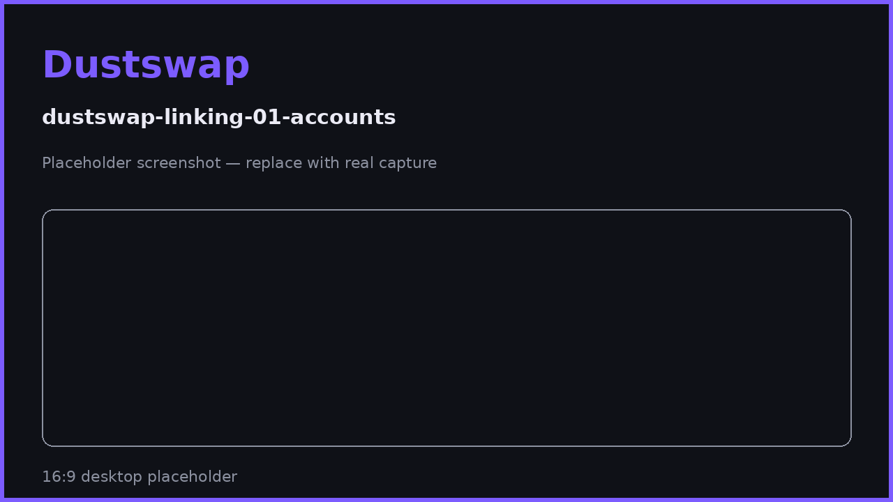

# Linking X & Discord

Social quests are verified through your linked X (Twitter) and Discord accounts — a one-time, OAuth-based setup. No passwords are shared with DustSwap, and no screenshots are ever needed.

## How linking works

Linking uses each platform's official sign-in flow (OAuth): you authorize on **x.com** or **discord.com** directly, and DustSwap receives only a verified identity (your account ID and username) — never your password, DMs, or posting rights beyond what the consent screen states.

## Linking X

1. Open the quest board or your Profile and choose **Link X**.
2. You are redirected to x.com's official authorization page — check the URL.
3. Approve. You return to DustSwap with your X handle attached to your account.

## Linking Discord

1. Choose **Link Discord** from the quest board or Profile.
2. Authorize on discord.com's official page.
3. For "Join our Discord" quests, DustSwap checks that your linked account is a member of the official server — join first, then verify.

## The rules

- **One social account per DustSwap account.** An X or Discord account already linked to a different wallet cannot be linked again — this prevents one account farming quests across many wallets.
- You can **disconnect** a linked account from your Profile and link a different one. Quests already claimed stay claimed; a newly linked account doesn't re-qualify you for them.
- Linking is required only for social quests — everything else in DustSwap works without it.

> **User Safety Note**
> The only legitimate places to authorize are **x.com** and **discord.com** — check the address bar before logging in. DustSwap's linking flow never asks for your password directly, never asks you to install anything, and never involves your wallet's seed phrase or signatures. Treat any deviation as phishing.

## FAQ

**What does DustSwap see from my X/Discord?**
Your account ID and public handle (and for Discord quests, whether you're in the DustSwap server) — only what's needed to verify quests.

**Can I link the same X account to two wallets?**
No. The platform-account-to-user binding is exclusive.

**I linked the wrong account.**
Disconnect it in your Profile and link the correct one.

**Does unlinking remove my earned PP?**
No — already-claimed quest rewards remain. The unlinked account just can't verify new quests for you.

## Related pages

- [How Quests Work](quests-overview.md)
- [Quest Verification & Claiming](verification.md)
