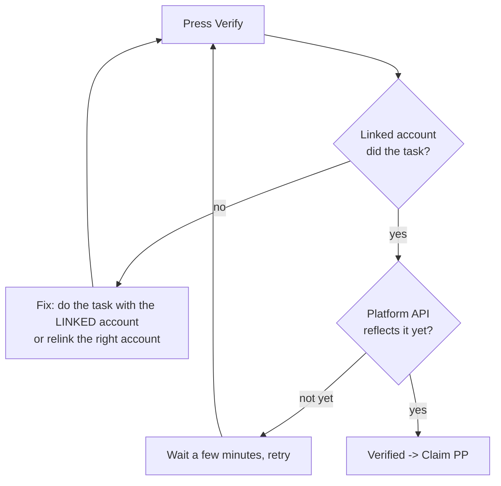

# Quest Verification & Claiming

How DustSwap confirms you actually completed a quest, why verification occasionally lags, and what to do when a quest won't verify.

## Verification, by quest type

| Quest type | What is checked | Typical timing |
|---|---|---|
| X follow / repost | Your **linked** X account's relationship to the target post/profile, via X's API | Seconds–minutes (API can lag) |
| Discord join | Your **linked** Discord account's membership in the official server | Near-instant once you've joined |
| On-chain (sweeps, swaps…) | Your verified app activity — the same server-checked transactions that award PP | Automatic as you act |

Everything is API- and chain-verified. There is no screenshot review, no manual submission, and no human judging your task.

## Claiming

- A quest that passes verification becomes claimable; claiming credits the PP **once** and marks the quest complete.
- Quest rewards are fixed (no streak boost) and appear in your PP history like any other earning.
- Claim promptly — campaigns can expire or be replaced.

## When verification fails

Work through these in order:

1. **Right account?** Verification checks the account *linked to DustSwap*, not whichever account your browser is logged into. Confirm in Profile → linked accounts.
2. **Action actually done?** Reposts must still exist (deleted reposts fail), Discord membership must be active.
3. **Wait and retry.** X's API in particular can take a few minutes to reflect a new follow or repost.
4. **On-chain quests:** the qualifying activity must run through the DustSwap app so it gets recorded — an identical action done elsewhere doesn't count.
5. Still stuck? Note the quest name and your wallet address and contact support.

> **User Safety Note**
> Failed verification never costs anything — retry freely. Be suspicious of anyone in Discord or X DMs offering to "manually verify" or "fast-track" a quest for a fee or a wallet signature; DustSwap staff never do this.

## FAQ

**I unfollowed/deleted the repost after claiming. Do I lose the PP?**
Claimed rewards are not automatically revoked, but gaming verification this way across many quests risks penalty. Keep it honest.

**The quest verified but claiming errored.**
Refresh and claim again — verification state persists.

**Why can't I verify a quest that's marked "expired"?**
Expired quests no longer accept verification or claims, even if you did the task while it was live. Claim before expiry.

## Related pages

- [How Quests Work](quests-overview.md)
- [Linking X & Discord](social-quests.md)
- [PP FAQ](../rewards/pp-faq.md)
