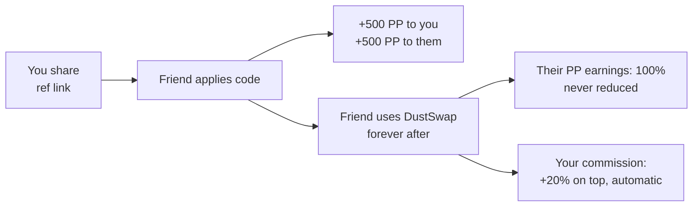

# How Referrals Work

Invite friends to DustSwap and you both win: each successful referral pays 500 PP to both sides, and you earn a 20% lifetime commission on everything your invitees earn.

## The basics

1. **Get your link.** Your Profile shows your personal referral code and share link (`app.dustswap.wtf/ref/yourcode`).
2. **Share it.** When someone opens your link, your code is ready to apply when they join.
3. **They apply the code.** Anyone who has never had a referrer can apply a code — once, permanently.
4. **You both earn:**

| Reward | Who gets it | When |
|---|---|---|
| **500 PP signup bonus** | **Both** — referrer and the new user | When the code is applied |
| **20% commission** | Referrer | Continuously, on the invitee's future PP earnings |

## The lifetime commission

Every time someone you referred earns PP from activity — check-ins, swaps, sweeps, burns, quests, spins — you automatically receive **20% of that amount as bonus PP**. Their earnings are never reduced; your commission is minted on top.

Example: your invitee has a strong week — 400 PP of boosted check-ins, 3,000 PP from sweeps, 1,500 PP from quests = 4,900 PP. You receive **980 PP** without doing anything.

What does *not* pay commission: referral bonuses themselves (your invitee inviting others earns *them* commission, not you — no multi-level cascading), and one-time drops like the Footprint Drop.

## Coming soon: Co-Founder Pass boost

A commission boost for **Co-Founder Pass** holders is planned: pass holders will earn an increased commission rate of **30%** instead of 20%. This is **not live yet** — details and launch timing will be announced. Nothing needs to be done now; the boost will apply automatically to qualifying holders when it ships.

## Rules and limits

- One referrer per account, ever — applying a code is permanent and can't be changed.
- You cannot refer yourself, and abusing multi-wallet self-referrals risks removal of wrongly earned PP.
- Signup bonuses and commissions are **not** multiplied by the streak boost.
- There is no cap on how many people you can refer or on lifetime commission.

> **User Safety Note**
> Referral links never ask for funds, approvals, or signatures — applying a code is a free in-app action. Be wary of fake "DustSwap referral" sites; only use links on the official **app.dustswap.wtf** domain.

## FAQ

**I already use DustSwap — can I still apply a friend's code?**
Yes, as long as you've never had a referrer. The 500 PP bonus applies when you do.

**Does my friend lose anything from my commission?**
No. They always keep 100% of their earnings; your 20% is added separately.

**Where do I track my referrals?**
Your Profile shows referral counts and earnings, and the [Leaderboards](../leaderboards/leaderboard-overview.md) include a referral ranking.

## Related pages

- [Referral Commission in Detail](referral-rewards.md)
- [Referral FAQ](referral-faq.md)
- [Leaderboards](../leaderboards/leaderboard-overview.md)
