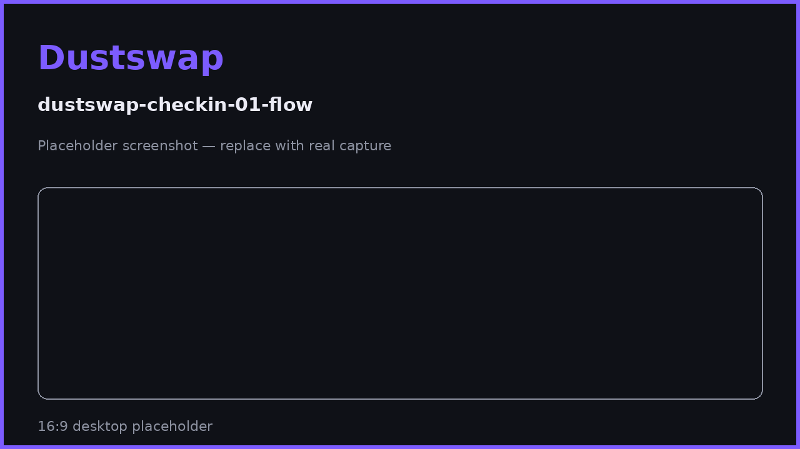
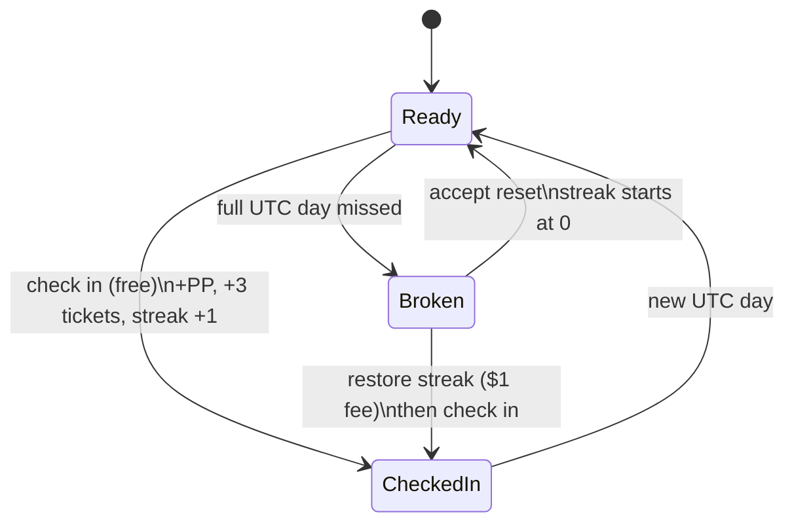

# Daily Check-In & Streaks

One tap per day: earn 100+ PP, grow a streak that multiplies all your earnings up to 4×, and collect 3 spin tickets. The check-in is free.

## What you get per check-in

| Reward | Amount |
|---|---|
| Particle Points | 100 PP × (1 + your streak boost) — from 100 PP on day 1 up to 400 PP at max boost |
| Spin tickets | +3 per check-in |
| Streak progress | +1 day toward the +300% boost cap |

## How to check in

1. Open DustSwap and connect your wallet.
2. Go to your **Profile** (or the check-in prompt on the home surface).
3. Press **Check in**. No transaction or fee — the check-in is free and instant.
4. Your PP, streak counter, boost percentage, and ticket balance update immediately.

## The rules

- **One check-in per UTC day.** Days run 00:00–23:59 **UTC**, not your local time. The app shows when the current day ends.
- **Consecutive UTC days build your streak.** Each day adds +10% to your PP boost, capping at **+300% on day 30** — and the streak keeps counting past 30 at max boost.
- **Missing a full UTC day breaks the streak.** Your boost returns to 0% — unless you restore it (see [Streak Recovery](streak-recovery.md)).
- The boost applies to nearly all PP earning, not just check-ins — see [Streak Boost Explained](streak-boost-explained.md).

## Streak states you'll see

| State | Meaning |
|---|---|
| **Ready** | You haven't checked in during the current UTC day — tap now. |
| **Checked in** | Done for today; shows when the next check-in unlocks. |
| **Active** | Streak alive, waiting for today's check-in. |
| **Broken** | A day was missed; a restore offer may be shown for recent breaks. |

> **User Safety Note**
> Checking in is free and never asks for a wallet signature or transaction. The only paid feature in this area is the optional $1 streak restore — anything else asking for payment or signatures around check-ins is not DustSwap.

## FAQ

**When exactly can I check in again?**
At 00:00 UTC. The app shows a countdown — don't rely on your local midnight.

**I checked in but my boost looks wrong.**
The boost shown applies to *future* earnings; the check-in you just made used the streak as of that moment.

**Do spin tickets expire?**
No expiry exists today. To be confirmed before publication if this changes.

**Can I check in from two devices?**
Yes — the check-in is per wallet, not per device. The second device will simply show "checked in".

## Related pages

- [Streak Boost Explained](streak-boost-explained.md)
- [Streak Recovery](streak-recovery.md)
- [Earning PP: Every Action & Cap](earning-pp.md)
