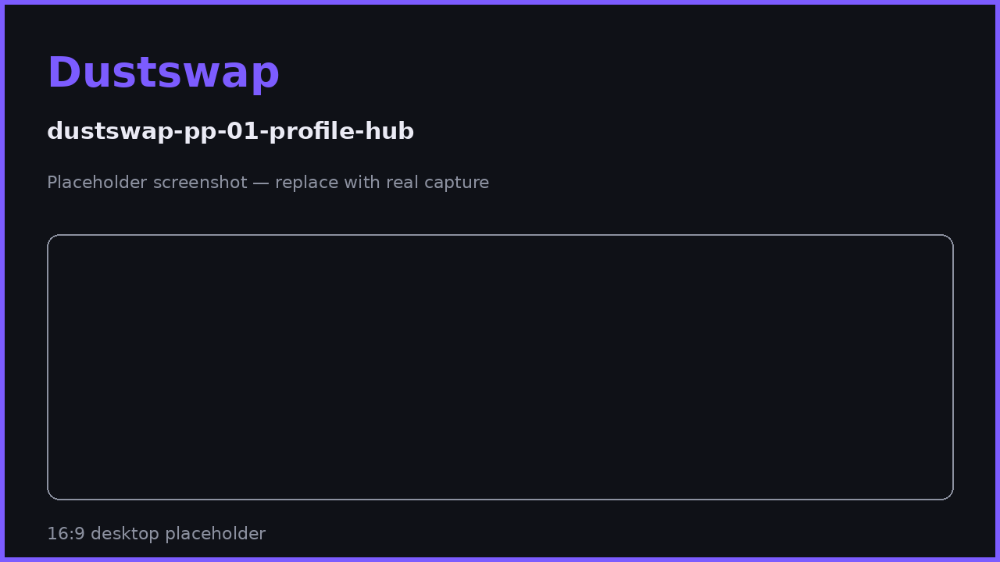

# What are Particle Points?

Particle Points (PP) are DustSwap's progression points. Almost everything you do in the app — swapping, sweeping dust, checking in daily, completing quests, inviting friends — earns PP, and your total drives your rank, streak boosts, and quest progress.

## What PP is

- A **points balance** attached to your wallet address, tracked by DustSwap.
- Earned by verified activity: every on-chain action is checked against the actual transaction before points are awarded; social actions are verified through linked accounts.
- Displayed on your [Profile](https://app.dustswap.wtf/profile) and ranked on the [Leaderboards](../leaderboards/leaderboard-overview.md).

## What PP is not

> **Important disclosure**
> PP is **not a cryptocurrency or token**. It does not exist on-chain, cannot be transferred, traded, or sold, and has **no monetary value** today. DustSwap plans to reward standing (including leaderboard rank) at a future **TGE (Token Generation Event)** — but structure, amounts, and timing are **not finalized or guaranteed**. Never pay anyone for PP, and treat any third party "selling" PP or "pre-TGE allocations" as a scam.

## How you earn PP

Every earning action, with exact amounts and daily caps, is listed on [Earning PP: Every Action & Cap](earning-pp.md). In short:

- **Daily check-in** — 100 PP base, multiplied by your streak boost, plus 3 spin tickets. See [Daily Check-In & Streaks](daily-check-in.md).
- **Activity** — swaps, dust sweeps, and burns each pay PP per action or per token, with daily caps.
- **Spin** — every spin wins 50–500 PP.
- **Quests** — one-time PP rewards for social and on-chain tasks. See [How Quests Work](../quests/quests-overview.md).
- **Referrals** — 500 PP per signup for both sides, plus a 20% lifetime commission on what your invitees earn. See [How Referrals Work](../referrals/how-referrals-work.md).
- **Footprint Drop** — a one-time drop of 5,000–26,000 PP based on your prior Base activity.

## The streak boost multiplies everything

Your daily check-in streak adds **+10% per consecutive day, up to +300% at day 30**, and the boost applies to almost every PP action — not just the check-in itself. A consistent user literally earns up to 4× more from the same activity. Full mechanics: [Streak Boost Explained](streak-boost-explained.md).

## Where to see your PP

Your Profile shows total PP, rank, earning history, streak status, and referral progress. The PP leaderboard ranks all users by total points.

## FAQ

**Can I lose PP?**
PP is not deducted by normal usage. Fraudulent activity (fake transactions, multi-account abuse) can lead to removal of wrongly earned points.

**Does PP expire?**
No expiry exists today. To be confirmed before publication if seasons change this.

**Will PP convert into a token or reward?**
Leaderboard rewards are planned at a future TGE, but no structure, amounts, or dates are finalized — nothing specific is guaranteed. See [Leaderboards](../leaderboards/leaderboard-overview.md).

**Is PP the same as spin tickets?**
No. Tickets are a separate balance used only to spin the wheel; spins th