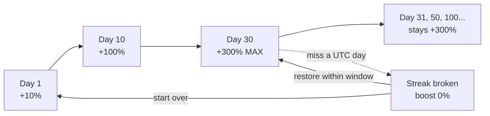
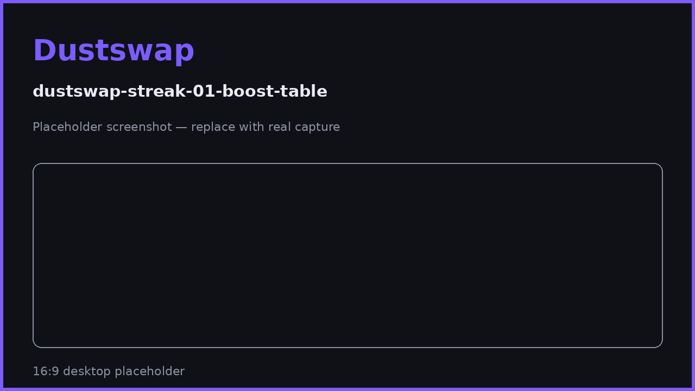

# Streak Boost Explained

Your check-in streak is the single biggest PP multiplier in DustSwap: +10% per consecutive day, up to +300% at day 30 — and it boosts almost every way you earn, not just the check-in itself.

## The math

```
boost = streak days × 10%, capped at +300%
```

| Streak day | Boost | Check-in pays | Any 1,000 PP action pays |
|---|---|---|---|
| 0 (no streak) | +0% | 100 PP | 1,000 PP |
| 1 | +10% | 110 PP | 1,100 PP |
| 5 | +50% | 150 PP | 1,500 PP |
| 10 | +100% | 200 PP | 2,000 PP |
| 20 | +200% | 300 PP | 3,000 PP |
| **30+** | **+300% (max)** | **400 PP** | **4,000 PP** |

Day 30 is the **boost cap, not a reset** — your streak keeps counting past 30 and the boost stays at the maximum +300% for as long as the streak lives.

## What the boost applies to

✓ Daily check-in, swaps, dust sweeps, burns, and (at launch) bridge rewards — all activity-based earning.

✗ Referral signup bonuses and referral commissions are **never** boosted. Spin prizes and quest rewards are fixed amounts.

## Keeping the streak alive

- Check in once every **UTC day** (00:00–23:59 UTC — not your local midnight).
- Missing a full UTC day breaks the streak; your boost drops to 0% and the count restarts — unless you restore it (see [Streak Recovery](streak-recovery.md)).
- The app shows your streak state at all times: ready to check in, checked in today, or broken.





## Strategy notes

- The boost multiplies **base** awards before daily caps are checked — a high boost helps you reach caps faster, it does not raise the caps.
- Time big actions for big streaks: a 50-token sweep at +300% earns 4× the PP of the same sweep with no streak.
- The check-in itself also grants 3 spin tickets, so a live streak compounds across check-in PP, boosted activity PP, and spin prizes.

## FAQ

**What time zone do streaks use?**
UTC, strictly. If you check in at 9 pm local but a new UTC day already started, that counts for the new UTC day.

**Does my streak reset at day 30?**
No. 30 is where the boost maxes out; the streak keeps counting upward.

**I missed a day — is the streak gone forever?**
You can restore a recently broken streak for a small fee. See [Streak Recovery](streak-recovery.md).

## Related pages

- [Daily Check-In & Streaks](daily-check-in.md)
- [Streak Recovery](streak-recovery.md)
- [Earning PP: Every Action & Cap](earning-pp.md)
